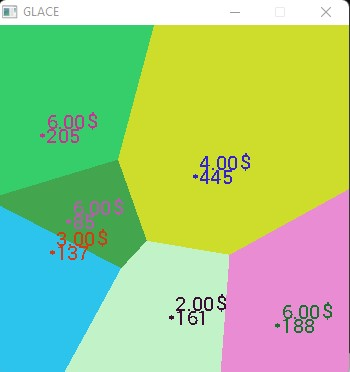
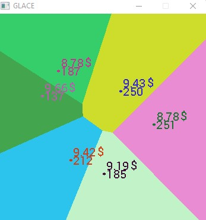
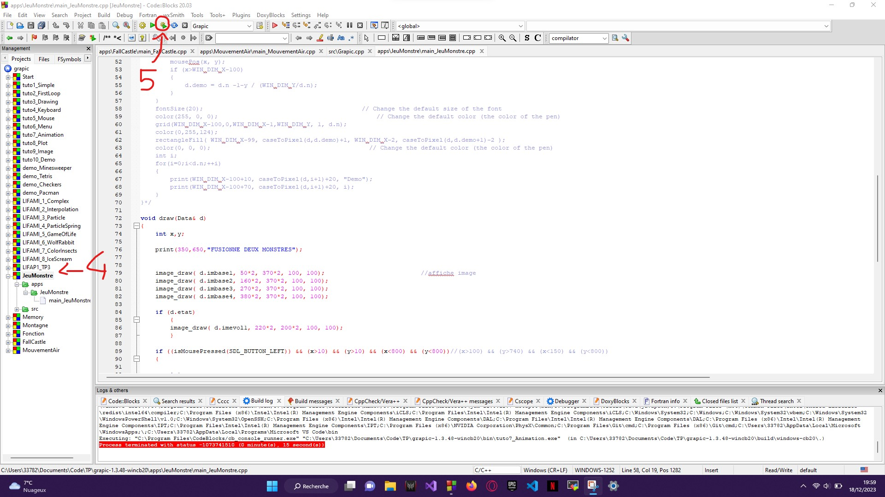

# Simulator Economy

Economic simulation of ice cream sellers:




# Subject

```
Hotelling's law states that in most markets, competition drives
producers to reduce the difference between their products. This law is also called
principle of minimal differentiation. It was formulated by the statistician and
American economist Harold Hotelling (1895-1973) in an article entitled Stability in
Competition. (Source Wikipedia: https://fr.wikipedia.org/wiki/Loi_de_Hotelling).

The problem of traveling ice cream sellers is a famous example of the theory
games, and a simplified approach to the Hotelling model.
Or a geographical area where N ice cream sellers come to set up. For
simplify, all the merchants sell the same ice cream, exactly identical but not to the
same price. A customer chooses his merchant by minimizing the “distance + price” function.

At each turn a merchant asks himself two questions:

- move your stand with 4 possible choices: x+1 or x-1 or y+1 or y-1;

- raise or lower its price by 10%.

Each merchant tests the 4 positions, compares them to the current position and changes if it
increases its revenues. He does the same for prices.

1. A merchant is represented by a position, a sale price, a color (this is to
display) and the number of customers. For the position you can retrieve the structure
Point of previous practicals. We find the income of a merchant by multiplying
the number of customers by the selling price.
LesMarchands will be a structure comprising a large painting of Marchand and the
size actually used in this table.
Write the two structures Merchant and LesMarchands including all the merchants
of the region.

2. Write the init procedure which randomly initializes all merchants. The merchands
will have a position in the Grapic window of size DIMW x DIMW. The prices will be
between 2 and 6 euros.

3. Write the drawMerchants procedure which displays a red circle of radius 2 pixels at the
position of each merchant.

4. Write the ProcessSale procedure that processes a geographic area. With Grapic, this
area will be the entire window. During initialization, you will set the number of clients to 0.
each merchant. Each pixel of the window will be a client which will take as color
that of the merchant he chooses. Reminder: a customer chooses the merchant who minimizes the
sum distance + price. Each time a customer chooses a merchant, they must add the
price of ice cream based on the merchant's cash flow.
For each pixel, you will call the put_pixel procedure to color the pixel with the
color of the chosen merchant:
Proc put_pixel(x,y: Integer, r,g,b: Integer)
Note: Do not call the winDisplay Grapic function in this
procedure because this procedure can be used to make intermediate calculations
when merchant positions/prices evolve to the next question.

5. Write the UpdateMerchants procedure which will update each merchant. For
this procedure you must have two LesMarchands structures, the one for before the
updated and the one that will be updated. Indeed, all merchants must do their
evolution simultaneously and not sequentially.

6. Add the code that allows you to display the price evolution of all of them in the form of curves
the merchands. Make observations with different initializations. When the prices
are they the lowest?

```

# GrAPiC 

## Starting

Linux, Windows and Mac instruction :

http://licence-info.univ-lyon1.fr/grapic

## Introduction

GrAPiC is a small, easy-to-use framework to add graphical functionalities to your C/C++ code. 
Its main goal is to provide easy graphical functions to be used in introduction courses of algorithm and programming in C/C++. 
It is based on SDL2 but to use it you need to know only few very simples functions. 
The Grapic archive comes with the needed SDL part, you do not have to install SDL. Just unzip and enjoy ! 

## Starting

Compiling from the github (which is not the standard way).

* On Linux you need to install:
- g++
- doxygen
- zip
- lib-sdl2-dev lib-sdl2 sd2_image... sdl2_ttf...

1. sudo apt install g++ premake4 zip doxygen libsdl2-dev libsdl2-mixer-dev libsdl2-image-dev
2. make premake
3. make
(4. script/make_linux_test.sh): to test the archive doc/download/grapic-linux.tgz
(5. script/make_web.sh): to create the zip files in doc/download or to sync everything to the webpage (need passwd).


* On windows
0. Install CB 20
1. run premake-cb20.bat to generate the projects files    or     run premake-lifami.bat to generate lifami projects 
2. open build/windows-cb20/grapic.workspace

## Best way to make a projet in windows

(windows): 
 - Open build/windows-cb20/grapic.workspace in CodeBlocks
 - In the left part (Management) of the logiciel, double clic in the projet of yours choice (it's those in /apps)
 - Finally clic in the green arrow in the top of the screen




## Put your new project in GraPic

Add your directory with your cpp files in "apps" and add the path in "premake4".

